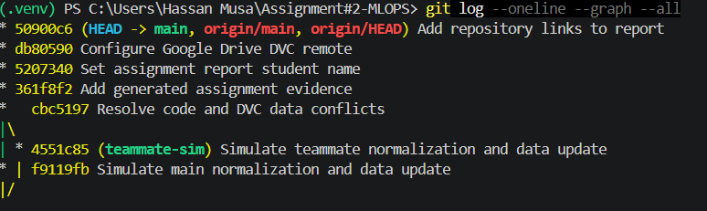
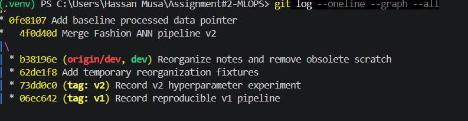
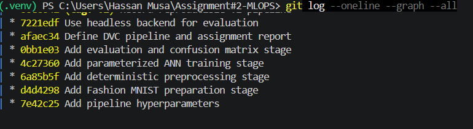
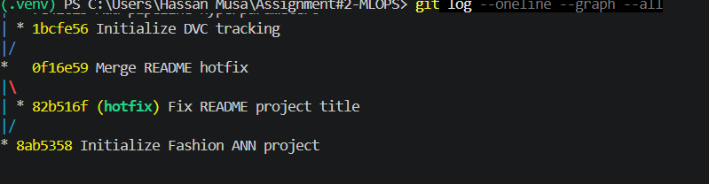
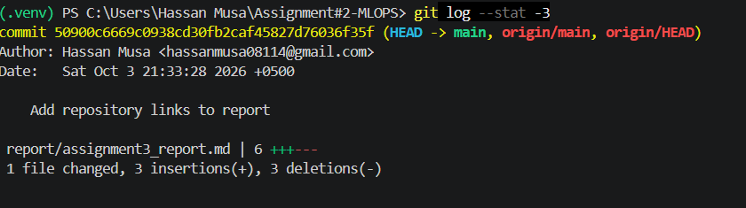
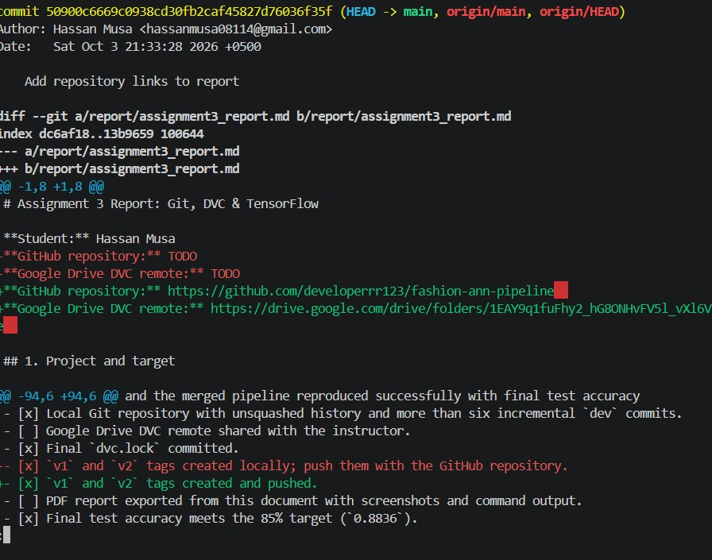
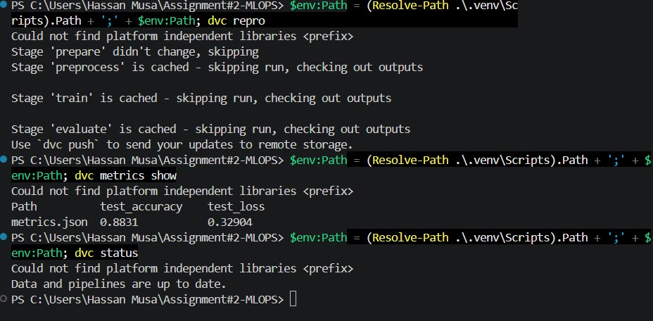
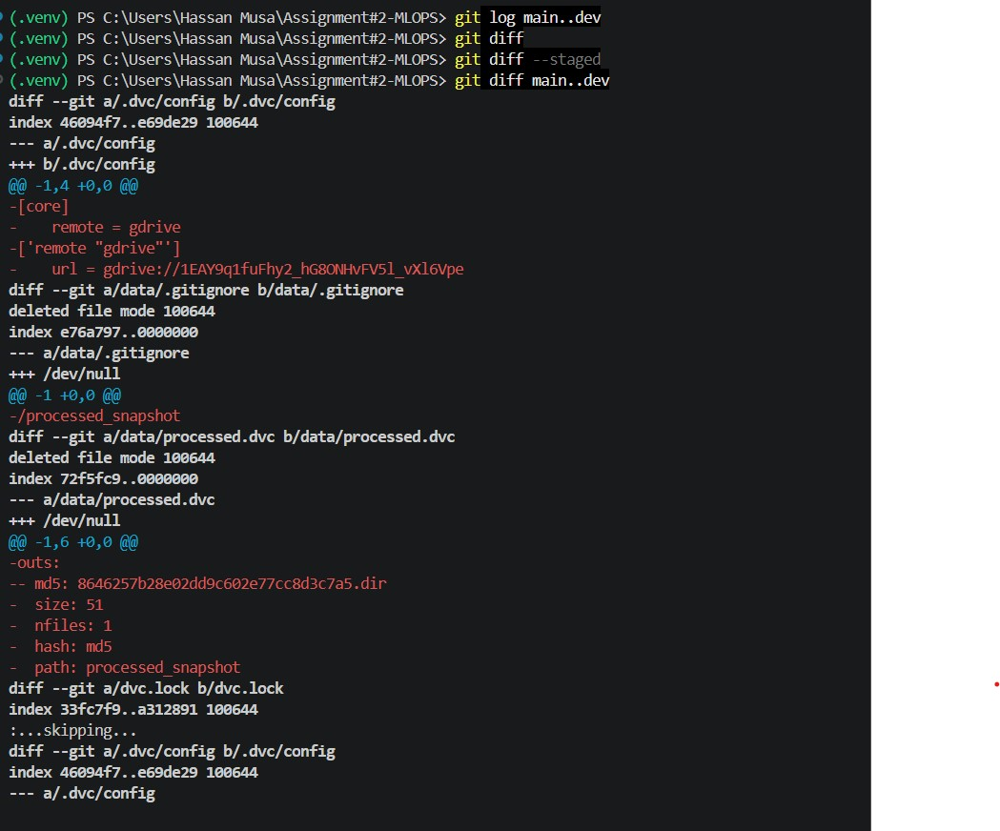

# Assignment 3: End-to-End ML Versioning

**Student:** Hassan Musa  
**GitHub:** https://github.com/developerrr123/fashion-ann-pipeline  
**DVC Google Drive folder:** https://drive.google.com/drive/folders/1EAY9q1fuFhy2_hG8ONHvFV5l_vXl6Vpe

## 1. Project Summary

This project builds a fully connected TensorFlow ANN for Fashion-MNIST. The pipeline is split into four independent stages: downloading raw data, preprocessing it, training the ANN, and evaluating the trained model. DVC tracks the data, model, metrics, and pipeline state; Git tracks the code and configuration.

The final model exceeded the required 85% test accuracy. The final merged run reached **88.36%** accuracy. A later cached reproduction reported **88.31%** accuracy and **0.32904** test loss.

## 2. Git Evidence

The repository contains an unsquashed history on `main` and `dev`. The Git history shows the initial project, DVC setup, separate pipeline-stage commits, the hotfix/rebase exercise, reset demonstration, file reorganization, v1/v2 experiments, and the simulated conflict merge.









`git log --stat -3` shows the latest commits and the files changed by each. `git log -p -1` shows the exact patch for the latest commit. The two-dot comparison (`git diff main..dev`) compares the branch tips, while the three-dot comparison (`git diff main...dev`) compares `dev` with the common ancestor.



The stash exercise paused an edit to `src/preprocess.py`, switched branches, displayed the stash with `git stash list`, and restored it with `git stash pop`. The reset exercise was performed on a temporary branch: `--soft` left changes staged, while `--hard` removed the commit and working-tree changes. The `git mv` and `git rm` operations are visible in the commit history as the move to `docs/pipeline_notes.md` and removal of `obsolete_scratch.txt`.



## 3. ML Pipeline and DVC Evidence

The pipeline is defined in `dvc.yaml` and uses `params.yaml` as its single source of hyperparameters. The stages are:

```text
prepare -> preprocess -> train -> evaluate
```

The DVC remote is configured as a Google Drive remote. The credentials were stored locally and excluded from Git. The ignore checks confirm that `.dvc/tmp`, `.dvc/cache`, generated data, models, and credentials are not committed.



The final reproduction output showed cached stages, followed by:

```text
dvc metrics show
metrics.json  0.8831  0.32904

dvc status
Data and pipelines are up to date.
```



The successful upload reported:

```text
8 files pushed
```


The Google Drive folder was used as the DVC remote and should be shared with the instructor for submission verification. No OAuth client secret is included in this report.

## 4. Parameter Reproduction Experiment

For v1, the hidden dense layer used 256 units. For v2, only `train.dense_units` changed to 384. DVC skipped `prepare` and `preprocess` because their dependencies and parameters were unchanged. It reran `train` and `evaluate` because both depended on the changed training parameter.

| Version | Dense units | Test loss | Test accuracy |
|---|---:|---:|---:|
| v1 | 256 | 0.3390 | 0.8799 |
| v2 | 384 | 0.3290 | 0.8831 |


## 5. Conflict Simulation and Resolution

Two branches independently changed the normalization code and the processed data pointer. Merging `teammate-sim` into `main` produced conflicts in both `src/preprocess.py` and `data/processed.dvc`. The main branch normalization and pointer were selected as authoritative. After resolving the files, `dvc checkout` synchronized the workspace, `dvc repro` reproduced the affected stages, and `dvc status` reported a clean state.

The resolution was committed with:

```text
Resolve code and DVC data conflicts
```

The final conflict-resolution result and branch relationships are visible in the Git history captures. The complete command evidence is also stored under `report/evidence/`.


## 6. Final Deliverables

- GitHub repository with full unsquashed history: complete.
- Google Drive DVC remote and successful `dvc push`: complete.
- `dvc.lock` committed at the final repository state: complete.
- v1 and v2 tags pushed to GitHub: complete.
- Final accuracy above 85%: complete.
- This report contains the written explanation, results, screenshots, and submission links.

The project was validated with three passing tests, a clean DVC status, and a successful GitHub push of `main`, `dev`, `v1`, and `v2`.
